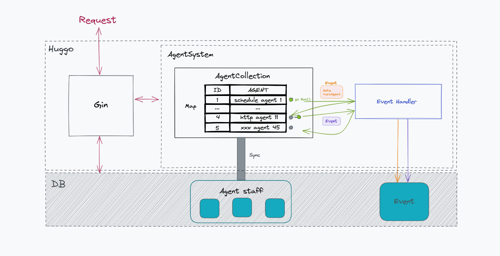
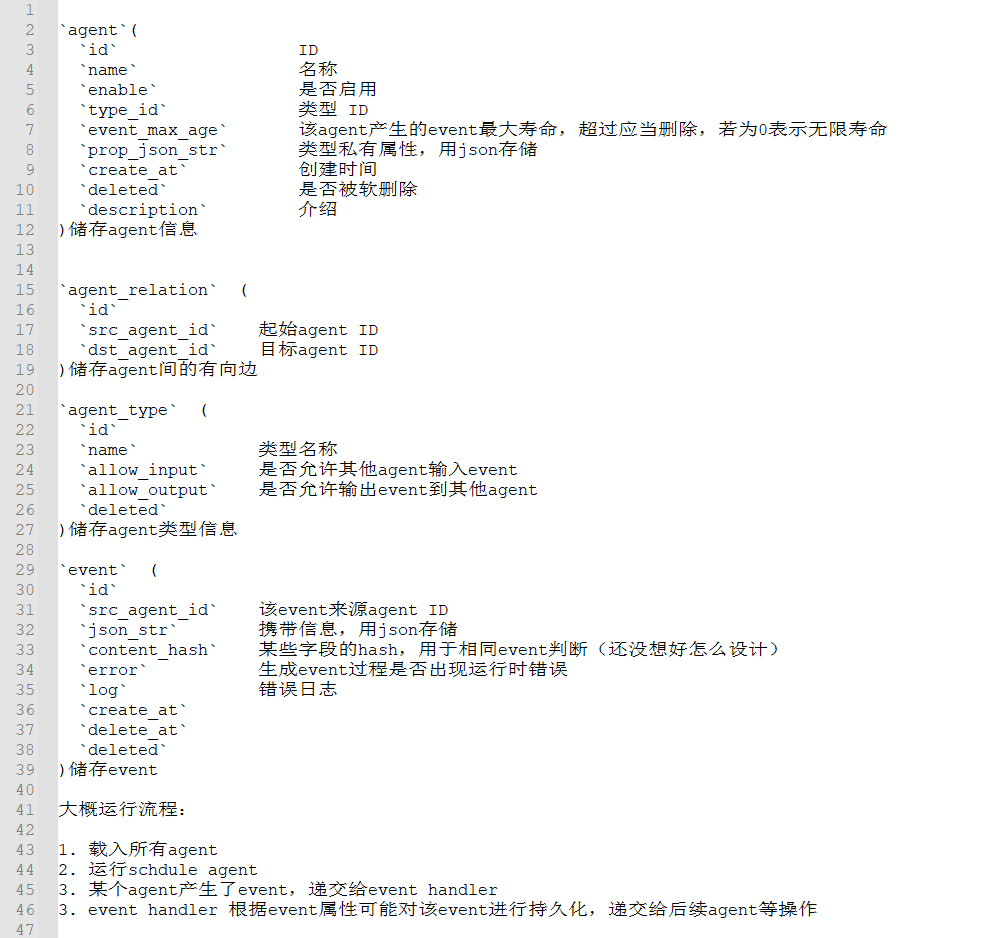

# Agent Type

## Schedule Agent

### Overview

Schedule Agent会定时产生一个临时的空Event，用于触发下游的Agent，只能存在于Agent链路头部

### Private Props

```json
{
    "cron":"{{ Cron format string }}"
}
```

#### Cron format used in Huggo
[Cron parser we use](https://pkg.go.dev/github.com/robfig/cron/v3)
```
Field name   | Mandatory? | Allowed values  | Allowed special characters
----------   | ---------- | --------------  | --------------------------
Seconds      | Yes        | 0-59            | * / , -
Minutes      | Yes        | 0-59            | * / , -
Hours        | Yes        | 0-23            | * / , -
Day of month | Yes        | 1-31            | * / , - ?
Month        | Yes        | 1-12 or JAN-DEC | * / , -
Day of week  | Yes        | 0-6 or SUN-SAT  | * / , - ?
```

#### Example

```json
{
    "cron":"*/30 * * * * *"
}
```
this agent will be actived every 30s

## Http Agent

### Overview

Http Agent接收到Event后，执行http请求，从Response中获取用户定义的字段打包为若干个Event传递给下游Agent (如果存在)

### Private Props

```json
{
    "onUpdate":bool,
    "mergeEvent":bool,
    "urls":[
        "{{*url}}"
    ],
    "method":"{{*http method}}",
    "header":{
        "{{*key}}":"{{*value}}"
    },
    "body":"{{*body}}",
    "template":{
        "{{*key}}":"{{*value}}"
    },
    "docType":"{{*response doc type}}",
    "selectors": [
        {
            "varName":"{{*key}}",
            "selectorType":"{{*seletor type}}",
            "selectorContent":"{{*seletor content}}"
        }
    ]
}
```
标注" * "的字段支持Liquid语法，所有Liquid字段均会从上个Event中获取数据，其中template部分还会从经selector处理请求后得到的键值对中获取数据

[Liquid 官方文档](https://liquid.bootcss.com/filters/split/)

#### About props

##### onUpdate

是否忽略与存在Event相同的Event（比如爬取博客时，每次执行任务都会获取到之前已经爬取到的旧文章，应该忽略这些旧文章，只将新文章打包成Event向下游传递）

##### mergeEvent

是否将输入Event的字段也打包进输出的Event中（比如上个Agent获取到了文章的名称和URL，我希望在这个Agent之后的Agent中使用文章名称字段，那么就可以该字段设置为true）

##### header

http请求的header

##### body

post和put请求的body

##### docType

Response的文档类型，当前支持 json

> TODO: html, text

##### selector

用于从Response中获取需要的数据，**打包进Event**

###### varname

字段名称

###### selectorType

选择器类型，当前只支持Xpath

###### selectorContent

选择器语句

##### template

对从上个Event和selector得到的字段进行Liquid处理，**打包进Event**，会覆盖已经存在的字段


### Example

```json
{
"urls": ["https://ipapi.co/{{ip}}/json/"],
"method": "GET",
"docType": "json",
"selectors": [
  {
	"varName": "timezone",
	"selectorType": "xpath",
	"selectorContent": "/timezone"
  }
],
"template": {
  "ip_blur": "{{ip | truncate: 8}}"
}
}
```

## RSS Agent

### Overview

RSS Agent将收到的Event打包进自己的rss feed文件里, 用户可以通过 ``/static/rss/{{agent id}}.xml`` 获取feed

### Private Props

```json
{
    "title": "feed标题",
    "link": "feed链接",
    "description": "feed简介",
    "author": "feed管理者",
    "template": {
      "title": "{{*item标题}}",
      "link": "{{*item链接}}",
      "description": "{{*item简介}}",
      "author": "{{*item内容原作者}}"
    }
  }
```
标注" * "的字段支持Liquid语法

使用的rss库暂不支持\<image\>

### Example

```json
{
    "title": "personal ht manga collection",
    "link": "https://xxx.com",
    "description": "富人玩车, ________",
    "author": "Nobody hero",
    "template": {
      "title": "{{manga_title}}",
      "link": "{{manga_url}}",
      "description": "{{manga_des}}",
      "author": "{{manga_artist}}"
    }
  }
```

# About


